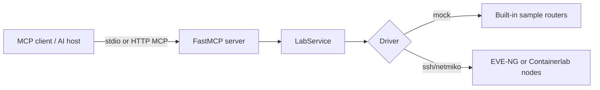

# From Chat to MCP: A Network Engineer's Path Through AI

This repo is a compact webinar demo for building a local MCP server that can talk to a
network lab. It uses FastMCP and exposes a small, useful set of tools:

| Tool | Purpose |
| --- | --- |
| `list_lab_devices` | Show the inventory the MCP server can reach. |
| `send_command` | Run a read-only show command on one device. |
| `run_health_check` | Run a small health bundle against one device or the whole lab. |
| `get_ospf_neighbors` | Read OSPF neighbor state with the right command per platform. |
| `get_bgp_summary` | Read BGP summary state with the right command per platform. |
| `configure_device` | Push config lines, dry-run by default, with confirmation required. |

The demo can run in mock mode with no lab, then switch to EVE-NG or Containerlab by changing
the inventory file.

## Architecture



FastMCP is deliberately thin here. The important teaching point is that MCP tools are just
typed Python functions with useful docstrings, while the actual networking code stays in a
normal service layer.

## Quick Start

Install the project:

```bash
uv venv
uv pip install -e ".[dev]"
```

Run the server in mock mode:

```bash
PACKET_CODERS_INVENTORY=configs/inventory.mock.yaml uv run packet-coders-mcp
```

Or run it through the FastMCP CLI:

```bash
PACKET_CODERS_INVENTORY=configs/inventory.mock.yaml \
  uv run fastmcp run src/packet_coders_mcp/server.py:mcp
```

Run it over HTTP for local MCP clients that prefer a URL:

```bash
PACKET_CODERS_INVENTORY=configs/inventory.mock.yaml \
  uv run fastmcp run src/packet_coders_mcp/server.py:mcp --transport http --port 8000
```

HTTP clients connect to:

```text
http://localhost:8000/mcp
```

## Client Config

For a stdio MCP client, use this shape and replace the paths with your absolute repo path:

```json
{
  "mcpServers": {
    "packet-coders-lab": {
      "command": "uv",
      "args": [
        "run",
        "--project",
        "/Users/elliotconner/PycharmProjects/Packet Coders Demo",
        "packet-coders-mcp"
      ],
      "env": {
        "PACKET_CODERS_INVENTORY": "/Users/elliotconner/PycharmProjects/Packet Coders Demo/configs/inventory.mock.yaml"
      }
    }
  }
}
```

There is also a template at `examples/mcp.json`.

## Inventory Model

Inventory is YAML:

```yaml
defaults:
  username: admin
  password: admin
  port: 22
  platform: cisco_ios
  transport: ssh

devices:
  r1:
    host: 192.0.2.11
    role: edge
  r2:
    host: 192.0.2.12
    role: edge
```

Supported `transport` values:

| Transport | Meaning |
| --- | --- |
| `mock` | Uses built-in demo outputs. No lab required. |
| `ssh` | Uses Netmiko to connect to the device. |

Common `platform` values:

| Platform | Notes |
| --- | --- |
| `cisco_ios`, `cisco_xe`, `ios` | IOS or IOS-XE style commands. |
| `cisco_nxos`, `nxos` | NX-OS style commands. |
| `arista_eos`, `eos` | Arista EOS style commands. |
| `junos`, `juniper_junos` | Junos style commands. |
| `frr`, `linux_frr` | FRR through `vtysh`. Good for Containerlab. |

## EVE-NG Setup

1. Put your lab devices on a management network reachable from the machine running this server.
2. Enable SSH on the nodes.
3. Copy `configs/inventory.eve-ng.example.yaml` to `inventory.local.yaml`.
4. Replace the `host`, `username`, `password`, and `platform` values.
5. Start the server with:

```bash
PACKET_CODERS_INVENTORY=inventory.local.yaml uv run packet-coders-mcp
```

## Containerlab Setup

A ready-to-deploy topology ships in `clab/ai.clab.yml`: three Arista cEOS nodes — two edge
routers (`r1`, `r2`) each peered to a spine (`spine1`) over OSPF area 0 and eBGP. The management
IPs match `configs/inventory.containerlab.example.yaml`, so the MCP server can reach them with no
extra wiring.

Prerequisites: an x86_64 Linux host (cEOS is x86_64-only — it will not run on Apple Silicon),
Docker, `containerlab`, and a cEOS image imported and tagged (free Arista account):

```bash
docker import cEOS-lab-4.35.1F.tar.xz ceos:4.35.1F
```

Set the `image:` tag in `clab/ai.clab.yml` to match your import, then deploy and run the server:

```bash
sudo containerlab deploy -t clab/ai.clab.yml
cp configs/inventory.containerlab.example.yaml inventory.local.yaml
PACKET_CODERS_INVENTORY=inventory.local.yaml uv run packet-coders-mcp
```

First cEOS boot takes a minute or two before SSH and the routing protocols are up. Tear the lab
down with `sudo containerlab destroy -t clab/ai.clab.yml`.

To use your own nodes instead, point the inventory at each node's management IPv4 address and set
`platform:` per device. The command map also supports `frr` (via `vtysh -c "show ..."`), `junos`,
and NX-OS platforms.

## Safety Model

This is a demo server, not a production change platform. It still has a few useful guardrails:

- `send_command` blocks obvious config and destructive commands.
- `configure_device` defaults to `dry_run=True`.
- Real config requires both `dry_run=False` and `confirm=True`.
- Dangerous config lines such as `reload`, `erase`, `delete`, and `write erase` are blocked.
- Do not point this at production networks.

## Suggested Webinar Flow

1. Start with `configs/inventory.mock.yaml` and list devices.
2. Show `server.py` and how `@mcp.tool` turns Python functions into MCP tools.
3. Run `get_ospf_neighbors` and `get_bgp_summary` against the mock lab.
4. Switch `PACKET_CODERS_INVENTORY` to an EVE-NG or Containerlab inventory.
5. Run the same tools against the real lab.
6. Demonstrate `configure_device` first as a dry run, then with `confirm=True` in a disposable lab.

## Development Checks

```bash
uv run --extra dev pytest
uv run --extra dev ruff check .
```
