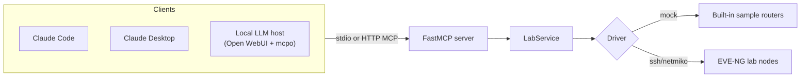

# From Chat to MCP: A Network Engineer's Path Through AI

This repo is a compact webinar demo for building a local MCP server that can talk to a
network lab. It uses FastMCP and exposes a small, useful set of tools:

| Tool | Purpose |
| --- | --- |
| `list_lab_devices` | Show the inventory the MCP server can reach. |
| `send_command` | Run a read-only show command on one device. |
| `run_health_check` | Run a small health bundle against one device or the whole lab. |
| `get_ospf_neighbors` | Read OSPF neighbor state with the right command per platform. |
| `get_bgp_summary` | Read BGP summary state with the right command per platform. |
| `configure_device` | Push config lines, dry-run by default, with confirmation required. |

The demo can run in mock mode with no lab, then switch to a real EVE-NG lab by changing
the inventory file. The same server works from Claude Code, Claude Desktop, or a fully
local LLM stack (Ollama / vLLM) — see [Connecting a client](#connecting-a-client).

## Architecture



FastMCP is deliberately thin here. The important teaching point is that MCP tools are just
typed Python functions with useful docstrings, while the actual networking code stays in a
normal service layer. The *model* never speaks MCP directly — an MCP **host** runs the
tool-calling loop and connects the tools to whatever model you point it at.

## Current Lab State (reference topology)

The live demo runs against **four Arista EOS switches in a full mesh**, all in a single
OSPF area. Every switch holds a `FULL` adjacency with the other three.

> **Note on addresses:** the management/SSH addresses are environment-specific and live
> only in your git-ignored `inventory.local.yaml` (see [Keeping the lab private](#keeping-the-lab-private)).
> The addresses below are the in-fabric OSPF/loopback addresses (RFC 1918) and are safe to
> share. Do not put your real management subnet in this file.

```text
            SW1 (10.255.0.1)
           /      |       \
   10.12.12/24  10.13.13/24  10.14.14/24
        /         |           \
     SW2 ------10.23.23/24------ SW3
   (10.255.0.2)      \         /  (10.255.0.3)
        \         10.24.24/24 10.34.34/24
         \____________|_______/
                     SW4 (10.255.0.4)
```

**Routers / router IDs** (each switch's `Loopback0` doubles as its OSPF router ID):

| Switch | Platform | Loopback0 / Router ID | OSPF process / area |
| --- | --- | --- | --- |
| SW1 | `arista_eos` | `10.255.0.1/32` | 1 / area 0 |
| SW2 | `arista_eos` | `10.255.0.2/32` | 1 / area 0 |
| SW3 | `arista_eos` | `10.255.0.3/32` | 1 / area 0 |
| SW4 | `arista_eos` | `10.255.0.4/32` | 1 / area 0 |

**Point-to-point links** (six `/24` transit segments, full mesh):

| Link | Subnet | A-side | B-side |
| --- | --- | --- | --- |
| SW1–SW2 | `10.12.12.0/24` | SW1 `Et1` .1 | SW2 `Et1` .2 |
| SW1–SW3 | `10.13.13.0/24` | SW1 `Et2` .1 | SW3 `Et2` .3 |
| SW1–SW4 | `10.14.14.0/24` | SW1 `Et3` .1 | SW4 `Et3` .4 |
| SW2–SW3 | `10.23.23.0/24` | SW2 `Et3` .2 | SW3 `Et3` .3 |
| SW2–SW4 | `10.24.24.0/24` | SW2 `Et2` .2 | SW4 `Et2` .4 |
| SW3–SW4 | `10.34.34.0/24` | SW3 `Et1` .3 | SW4 `Et1` .4 |

Each switch advertises its `Loopback0/32` into area 0, so every loopback is reachable from
every switch. Adding a demo loopback (e.g. `Loopback11 10.255.0.11/32` advertised into
area 0) and watching it appear in the other switches' routing tables is a clean way to show
`configure_device` driving a real change end-to-end.

## Quick Start

Install the project:

```bash
uv venv
uv pip install -e ".[dev]"
```

Run the server in mock mode (no lab required):

```bash
PACKET_CODERS_INVENTORY=configs/inventory.mock.yaml uv run packet-coders-mcp
```

Or run it through the FastMCP CLI:

```bash
PACKET_CODERS_INVENTORY=configs/inventory.mock.yaml \
  uv run fastmcp run src/packet_coders_mcp/server.py:mcp
```

Run it over HTTP for clients that prefer a URL:

```bash
PACKET_CODERS_INVENTORY=configs/inventory.mock.yaml \
  uv run fastmcp run src/packet_coders_mcp/server.py:mcp --transport http --port 8000
```

HTTP clients connect to:

```text
http://localhost:8000/mcp
```

## Connecting a client

All clients use the same stdio launch shape. Replace `<ABSOLUTE_PATH_TO_REPO>` with the
absolute path to your local clone, and point `PACKET_CODERS_INVENTORY` at the inventory you
want (start with `configs/inventory.mock.yaml`, switch to your git-ignored
`inventory.local.yaml` for the real lab). A ready-to-edit template lives at
`examples/mcp.json`.

### Claude Code

Register the server from the repo root with the CLI:

```bash
claude mcp add packet-coders-lab \
  --env PACKET_CODERS_INVENTORY=<ABSOLUTE_PATH_TO_REPO>/configs/inventory.mock.yaml \
  -- uv run --project <ABSOLUTE_PATH_TO_REPO> packet-coders-mcp
```

Or commit a project-scoped `.mcp.json` at the repo root:

```json
{
  "mcpServers": {
    "packet-coders-lab": {
      "command": "uv",
      "args": [
        "run",
        "--project",
        "<ABSOLUTE_PATH_TO_REPO>",
        "packet-coders-mcp"
      ],
      "env": {
        "PACKET_CODERS_INVENTORY": "<ABSOLUTE_PATH_TO_REPO>/configs/inventory.mock.yaml"
      }
    }
  }
}
```

Verify with `/mcp` inside Claude Code, then call `list_lab_devices`.

### Claude Desktop

Add the same server block to Claude Desktop's config file, then restart the app.

- macOS: `~/Library/Application Support/Claude/claude_desktop_config.json`
- Windows: `%APPDATA%\Claude\claude_desktop_config.json`

```json
{
  "mcpServers": {
    "packet-coders-lab": {
      "command": "uv",
      "args": [
        "run",
        "--project",
        "<ABSOLUTE_PATH_TO_REPO>",
        "packet-coders-mcp"
      ],
      "env": {
        "PACKET_CODERS_INVENTORY": "<ABSOLUTE_PATH_TO_REPO>/configs/inventory.mock.yaml"
      }
    }
  }
}
```

`uv` must be on the PATH that the desktop app inherits. If the server does not appear, use
an absolute path to the `uv` binary (`which uv`) as the `command`.

### Local LLMs (Ollama / vLLM)

You can drive this server entirely with a local model — no Anthropic API involved. The key
idea is the split between the **MCP host** (runs the tool-calling loop) and the **inference
backend** (serves chat completions). The model itself does not speak MCP; the host does.

This guide uses **[Open WebUI](https://github.com/open-webui/open-webui) + [mcpo](https://github.com/open-webui/mcpo)**.
`mcpo` wraps a stdio MCP server as an OpenAPI tool server that Open WebUI can call, and Open
WebUI connects to either backend below.

```text
Open WebUI (MCP host)
  ├── mcpo  ──► packet-coders-mcp (this server)
  └── chat completions ──►  Ollama   @ Mac Mini   (Qwen3 ~30B-class)
                           vLLM     @ GPU box     (smaller models)
```

**1. Expose the MCP server through mcpo:**

```bash
PACKET_CODERS_INVENTORY=<ABSOLUTE_PATH_TO_REPO>/configs/inventory.mock.yaml \
  uvx mcpo --port 8000 -- uv run --project <ABSOLUTE_PATH_TO_REPO> packet-coders-mcp
```

In Open WebUI, add `http://localhost:8000` as a Tool server (Settings → Tools). The six
lab tools then show up to the model.

**2a. Backend — Ollama (e.g. on a Mac Mini, reached over Tailscale):**

- Point Open WebUI's Ollama connection at the tailnet host: `http://<your-tailnet-host>:11434`.
- Use a **tool-calling-capable** model (Qwen3 is a strong pick; it selects tools reliably).
- **Raise the context window.** Ollama defaults to a small context (~4K), and the tool
  schemas plus verbose `show` output overflow it — which looks like "the model ignored the
  tools." Set it larger, e.g. `OLLAMA_CONTEXT_LENGTH=32768 ollama serve`, or bake `num_ctx`
  into a Modelfile.

**2b. Backend — vLLM (e.g. on a GPU box, OpenAI-compatible):**

- Tool calling is **off by default** in vLLM. Launch with auto tool choice **and** a parser
  that matches your model:

  ```bash
  vllm serve <your-qwen3-model> --enable-auto-tool-choice --tool-call-parser hermes
  ```

  The correct `--tool-call-parser` is model-dependent (Qwen-family commonly uses the
  `hermes` parser) — **verify against the current vLLM docs for your exact model.** With the
  wrong parser, the model emits tool calls as plain text and nothing fires.
- Add it to Open WebUI as an OpenAI connection: `http://<your-tailnet-host>:8000/v1`.

**Model-strength guidance:** lead with the larger Qwen3 model as the "driver" — it picks
the right tool and emits clean JSON. Keep smaller models (and Gemma variants, which are less
consistent at function calling) on the **read-only** tools, or on `configure_device` with
`dry_run=True` only. A weak model in an auto-confirming agent loop is exactly where you do
*not* want unattended writes — keep a human in the loop for any real change (see
[Safety model](#safety-model)).

## Inventory Model

Inventory is YAML:

```yaml
defaults:
  username: admin
  password: admin
  port: 22
  platform: cisco_ios
  transport: ssh

devices:
  r1:
    host: 192.0.2.11
    role: edge
  r2:
    host: 192.0.2.12
    role: edge
```

Supported `transport` values:

| Transport | Meaning |
| --- | --- |
| `mock` | Uses built-in demo outputs. No lab required. |
| `ssh` | Uses Netmiko to connect to the device. |

Common `platform` values:

| Platform | Notes |
| --- | --- |
| `cisco_ios`, `cisco_xe`, `ios` | IOS or IOS-XE style commands. |
| `cisco_nxos`, `nxos` | NX-OS style commands. |
| `arista_eos`, `eos` | Arista EOS style commands. |
| `junos`, `juniper_junos` | Junos style commands. |
| `frr`, `linux_frr` | FRR through `vtysh`. |

## EVE-NG Setup

1. Put your lab devices on a management network reachable from the machine running this server.
2. Enable SSH on the nodes.
3. Copy `configs/inventory.eve-ng.example.yaml` to `inventory.local.yaml`.
4. Replace the `host`, `username`, `password`, and `platform` values.
5. Start the server with:

```bash
PACKET_CODERS_INVENTORY=inventory.local.yaml uv run packet-coders-mcp
```

## Keeping the lab private

This README and the committed configs deliberately contain **no real credentials, no real
management IPs, and no machine-specific paths**:

- Real credentials and management addresses live only in `inventory.local.yaml`, which is
  git-ignored. The committed `configs/*.yaml` use `admin/admin` placeholders and the RFC 5737
  documentation range (`192.0.2.0/24`).
- Client configs that hold your absolute paths or tailnet hostnames go in `mcp.local.json`
  (also git-ignored). Keep `<ABSOLUTE_PATH_TO_REPO>` / `<your-tailnet-host>` as placeholders
  in anything you commit or share.
- Keep your inference backends (Ollama/vLLM) on the tailnet, never exposed to the public
  internet — an open Ollama/vLLM port is an unauthenticated model and tool surface.
- In-fabric OSPF/loopback addresses (`10.x`) are safe to share; your real management subnet
  is not — don't paste it into docs.

## Safety Model

This is a demo server, not a production change platform. It still has a few useful guardrails:

- `send_command` blocks obvious config and destructive commands.
- `configure_device` defaults to `dry_run=True`.
- Real config requires both `dry_run=False` and `confirm=True`.
- Dangerous config lines such as `reload`, `erase`, `delete`, and `write erase` are blocked.
- High-impact writes should stay human-confirmed — do not let an agent loop auto-approve
  `configure_device` against a live device.
- Do not point this at production networks.

## Suggested Webinar Flow

1. Start with `configs/inventory.mock.yaml` and list devices.
2. Show `server.py` and how `@mcp.tool` turns Python functions into MCP tools.
3. Run `get_ospf_neighbors` and `get_bgp_summary` against the mock lab.
4. Switch `PACKET_CODERS_INVENTORY` to the EVE-NG inventory (the four-switch mesh above).
5. Run the same tools against the real lab and show the full-mesh adjacencies.
6. Demonstrate `configure_device` first as a dry run, then with `confirm=True` — add and
   then remove a demo loopback, verifying it appears in OSPF.
7. Optional: repeat the demo driven by a local Qwen3 model to show the same tools with no
   cloud API.

## Development Checks

```bash
uv run --extra dev pytest
uv run --extra dev ruff check .
```
