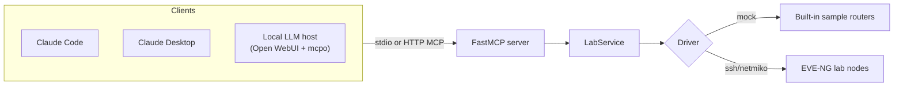

# From Chat to MCP: A Network Engineer's Path Through AI

This repo is a compact webinar demo for building a local MCP server that can talk to a
network lab. It uses FastMCP and exposes a small, useful set of tools:

| Tool | Purpose |
| --- | --- |
| `list_lab_devices` | Show the inventory the MCP server can reach. |
| `send_command` | Run a read-only show command on one device. |
| `run_health_check` | Run a small health bundle against one device or the whole lab. |
| `get_ospf_neighbors` | Read OSPF neighbor state with the right command per platform. |
| `get_bgp_summary` | Read BGP summary state with the right command per platform. |
| `configure_device` | Push config lines, gated by a one-time out-of-band confirmation code (read-only mode is one flag). |

The demo can run in mock mode with no lab, then switch to a real EVE-NG lab by changing
the inventory file. The same server works from Claude Code, Claude Desktop, or a fully
local LLM stack (Ollama / vLLM) — see [Connecting a client](#connecting-a-client).

## Quickstart — one command (Docker)

Spin up the **whole stack** — chat UI, lab tools, and a local model — with one command.
No Python setup, no manual wiring. The code stays in the repo for you to read/edit in your IDE.

```bash
git clone https://github.com/E-Conners-Lab/Packet-Coders-Demo.git
cd packet-coders-mcp
docker compose up            # first run pulls images + the qwen3:8b model (a few minutes)
```

Open **http://localhost:3000** (no login). One-time: **Settings → Integrations →** add
`http://localhost:8000` as a tool server, set the model's **Function Calling → Native**, then
ask *"list the lab devices."* Defaults to the **mock lab** (no hardware). Config changes are
available but **gated**: each one prints a one-time confirmation code to the server console that
*you* must read back before it applies — a model can't self-approve (see [Safety Model](#safety-model)).

| Want… | Command |
| --- | --- |
| Faster model on a Mac (host Ollama, Metal GPU) | `make up-host` |
| Read-only (hide the write tool entirely) | `make readonly` |
| The real EVE-NG lab | uncomment the inventory mount in `docker-compose.yml`, then `docker compose up` |
| Stop everything | `make down` |

Prefer no Docker? Run it natively in 5 minutes instead:

## Try it in 5 minutes (no lab, no extra hardware)

You do **not** need a network lab, a GPU, Tailscale, or an API key to see a local LLM
drive these tools. One laptop with [Ollama](https://ollama.com) and
[uv](https://docs.astral.sh/uv/) is enough — the server ships with a built-in **mock lab**.

```bash
# 1. Pull a small tool-calling model (~2 GB; needs ~8 GB RAM)
ollama pull llama3.2

# 2. Install this project
uv venv && uv pip install -e .

# 3. Ask a local model a question about the (mock) lab
LLM_MODEL=llama3.2 uv run python scripts/local_llm_smoke.py "List the lab devices."
```

Expected: the model calls `list_lab_devices` and answers `r1, r2, spine1` — all running
locally, no cloud, no network gear. The script defaults to local Ollama
(`http://localhost:11434/v1`) and the mock inventory, and only exposes read-only tools.

**That's the whole loop.** From here you can scale up *one variable at a time*:

| Want… | Change just this |
| --- | --- |
| Better tool-calling | `ollama pull qwen3:8b` then `LLM_MODEL=qwen3:8b` |
| A different/remote model | `LLM_BASE_URL=http://<host>:11434/v1` (Ollama) or `:8000/v1` (vLLM) |
| A real lab instead of mock | `PACKET_CODERS_INVENTORY=./inventory.local.yaml` (see [EVE-NG Setup](#eve-ng-setup)) |
| A chat UI | add Open WebUI (see [Local LLMs](#local-llms-ollama--vllm)) |

## Architecture



FastMCP is deliberately thin here. The important teaching point is that MCP tools are just
typed Python functions with useful docstrings, while the actual networking code stays in a
normal service layer. The *model* never speaks MCP directly — an MCP **host** runs the
tool-calling loop and connects the tools to whatever model you point it at.

## Current Lab State (reference topology)

The live demo runs against **four Arista EOS switches in a full mesh**, running **two
protocols at once**: OSPF (single area 0) carries the transit links, and a full mesh of
**eBGP** sessions advertises the loopbacks. Every switch holds a `FULL` OSPF adjacency *and*
an `Established` eBGP session with the other three.

> **Note on addresses:** the management/SSH addresses are environment-specific and live
> only in your git-ignored `inventory.local.yaml` (see [Keeping the lab private](#keeping-the-lab-private)).
> The addresses below are the in-fabric OSPF/loopback addresses (RFC 1918) and are safe to
> share. Do not put your real management subnet in this file.

```text
            SW1 (10.255.0.1)
           /      |       \
   10.12.12/24  10.13.13/24  10.14.14/24
        /         |           \
     SW2 ------10.23.23/24------ SW3
   (10.255.0.2)      \         /  (10.255.0.3)
        \         10.24.24/24 10.34.34/24
         \____________|_______/
                     SW4 (10.255.0.4)
```

**Routers / router IDs** (each switch's `Loopback0` doubles as its OSPF + BGP router ID):

| Switch | Platform | Loopback0 / Router ID | OSPF process / area | BGP AS |
| --- | --- | --- | --- | --- |
| SW1 | `arista_eos` | `10.255.0.1/32` | 1 / area 0 | `65001` |
| SW2 | `arista_eos` | `10.255.0.2/32` | 1 / area 0 | `65002` |
| SW3 | `arista_eos` | `10.255.0.3/32` | 1 / area 0 | `65003` |
| SW4 | `arista_eos` | `10.255.0.4/32` | 1 / area 0 | `65004` |

**Point-to-point links** (six `/24` transit segments, full mesh):

| Link | Subnet | A-side | B-side |
| --- | --- | --- | --- |
| SW1–SW2 | `10.12.12.0/24` | SW1 `Et1` .1 | SW2 `Et1` .2 |
| SW1–SW3 | `10.13.13.0/24` | SW1 `Et2` .1 | SW3 `Et2` .3 |
| SW1–SW4 | `10.14.14.0/24` | SW1 `Et3` .1 | SW4 `Et3` .4 |
| SW2–SW3 | `10.23.23.0/24` | SW2 `Et3` .2 | SW3 `Et3` .3 |
| SW2–SW4 | `10.24.24.0/24` | SW2 `Et2` .2 | SW4 `Et2` .4 |
| SW3–SW4 | `10.34.34.0/24` | SW3 `Et1` .3 | SW4 `Et1` .4 |

Reachability is split by protocol, which is visible in any switch's `show ip route`: `C` for
the three local transit links and its own loopback, `O` for the three **remote transit
`/24`s** (learned via OSPF), and `B` for the three **remote loopbacks** (the rest of the
`10.255.0.0/24` space, learned via eBGP). The eBGP sessions peer over the directly connected
transit-link addresses — SW1 (`AS 65001`) peers with `10.12.12.2` (`AS 65002`), `10.13.13.3`
(`AS 65003`), and `10.14.14.4` (`AS 65004`).

Adding a demo loopback with `configure_device` and watching it propagate is a clean way to
show a real change end-to-end: advertise it into OSPF and it appears as `O` on the neighbors,
or originate it with a BGP `network` statement and it appears as `B`.

## Quick Start

Install the project:

```bash
uv venv
uv pip install -e ".[dev]"
```

Run the server in mock mode (no lab required):

```bash
PACKET_CODERS_INVENTORY=configs/inventory.mock.yaml uv run packet-coders-mcp
```

Or run it through the FastMCP CLI:

```bash
PACKET_CODERS_INVENTORY=configs/inventory.mock.yaml \
  uv run fastmcp run src/packet_coders_mcp/server.py:mcp
```

Run it over HTTP for clients that prefer a URL:

```bash
PACKET_CODERS_INVENTORY=configs/inventory.mock.yaml \
  uv run fastmcp run src/packet_coders_mcp/server.py:mcp --transport http --port 8000
```

HTTP clients connect to:

```text
http://localhost:8000/mcp
```

## Connecting a client

All clients use the same stdio launch shape. Replace `<ABSOLUTE_PATH_TO_REPO>` with the
absolute path to your local clone, and point `PACKET_CODERS_INVENTORY` at the inventory you
want (start with `configs/inventory.mock.yaml`, switch to your git-ignored
`inventory.local.yaml` for the real lab). A ready-to-edit template lives at
`examples/mcp.json`.

### Claude Code

Register the server from the repo root with the CLI:

```bash
claude mcp add packet-coders-lab \
  --env PACKET_CODERS_INVENTORY=<ABSOLUTE_PATH_TO_REPO>/configs/inventory.mock.yaml \
  -- uv run --project <ABSOLUTE_PATH_TO_REPO> packet-coders-mcp
```

Or commit a project-scoped `.mcp.json` at the repo root:

```json
{
  "mcpServers": {
    "packet-coders-lab": {
      "command": "uv",
      "args": [
        "run",
        "--project",
        "<ABSOLUTE_PATH_TO_REPO>",
        "packet-coders-mcp"
      ],
      "env": {
        "PACKET_CODERS_INVENTORY": "<ABSOLUTE_PATH_TO_REPO>/configs/inventory.mock.yaml"
      }
    }
  }
}
```

Verify with `/mcp` inside Claude Code, then call `list_lab_devices`.

### Claude Desktop

Add the same server block to Claude Desktop's config file, then restart the app.

- macOS: `~/Library/Application Support/Claude/claude_desktop_config.json`
- Windows: `%APPDATA%\Claude\claude_desktop_config.json`

```json
{
  "mcpServers": {
    "packet-coders-lab": {
      "command": "uv",
      "args": [
        "run",
        "--project",
        "<ABSOLUTE_PATH_TO_REPO>",
        "packet-coders-mcp"
      ],
      "env": {
        "PACKET_CODERS_INVENTORY": "<ABSOLUTE_PATH_TO_REPO>/configs/inventory.mock.yaml"
      }
    }
  }
}
```

`uv` must be on the PATH that the desktop app inherits. If the server does not appear, use
an absolute path to the `uv` binary (`which uv`) as the `command`.

### Local LLMs (Ollama / vLLM)

You can drive this server entirely with a local model — no Anthropic API involved. The key
idea is the split between the **MCP host** (runs the tool-calling loop) and the **inference
backend** (serves chat completions). The model itself does not speak MCP; the host does.

This guide uses **[Open WebUI](https://github.com/open-webui/open-webui) + [mcpo](https://github.com/open-webui/mcpo)**.
`mcpo` wraps a stdio MCP server as an OpenAPI tool server that Open WebUI can call, and Open
WebUI connects to either backend below.

```text
Open WebUI (MCP host)
  ├── mcpo  ──► packet-coders-mcp (this server)
  └── chat completions ──►  Ollama   @ Mac Mini   (Qwen3 ~30B-class)
                           vLLM     @ GPU box     (smaller models)
```

**1. Expose the MCP server through mcpo:**

```bash
PACKET_CODERS_INVENTORY=<ABSOLUTE_PATH_TO_REPO>/configs/inventory.mock.yaml \
  uvx mcpo --port 8000 -- uv run --project <ABSOLUTE_PATH_TO_REPO> packet-coders-mcp
```

In Open WebUI, add `http://localhost:8000` as a **tool server** (**Settings → Integrations →
Manage Tool Servers** — called *Tools* in older builds). The six lab tools then show up to the
model. **If you run Open WebUI in Docker, that URL has a catch — see [Open WebUI setup](#open-webui-setup)
below for the `localhost` vs `host.docker.internal` split and the *Function Calling → Native*
step that makes tools actually fire.**

**2a. Backend — Ollama (e.g. on a Mac Mini, reached over Tailscale):**

- Point Open WebUI's Ollama connection at the tailnet host: `http://<your-tailnet-host>:11434`.
- Use a **tool-calling-capable** model (Qwen3 is a strong pick; it selects tools reliably).
- **Raise the context window.** Ollama defaults to a small context (~4K), and the tool
  schemas plus verbose `show` output overflow it — which looks like "the model ignored the
  tools." Set it larger, e.g. `OLLAMA_CONTEXT_LENGTH=32768 ollama serve`, or bake `num_ctx`
  into a Modelfile.

**2b. Backend — vLLM (e.g. on a GPU box, OpenAI-compatible):**

- Tool calling is **off by default** in vLLM. Launch with auto tool choice **and** a parser
  that matches your model:

  ```bash
  vllm serve <your-qwen3-model> --enable-auto-tool-choice --tool-call-parser hermes
  ```

  The correct `--tool-call-parser` is model-dependent (Qwen-family commonly uses the
  `hermes` parser) — **verify against the current vLLM docs for your exact model.** With the
  wrong parser, the model emits tool calls as plain text and nothing fires.
- Add it to Open WebUI as an OpenAI connection: `http://<your-tailnet-host>:8000/v1`.

#### Open WebUI setup

The steps above assume Open WebUI is already running. If you're standing one up from scratch —
or you hit *"error connecting to the server"* or *"the model ignores the tools"* — this is the
part that trips everyone up.

**Run a disposable local Open WebUI (optional).** Any existing instance works; this just gives
you a clean one on the same machine as the model and the tools:

```bash
docker run -d -p 3000:8080 \
  --add-host=host.docker.internal:host-gateway \
  -e WEBUI_AUTH=False \
  -e OLLAMA_BASE_URL=http://host.docker.internal:11434 \
  -v owui-demo:/app/backend/data \
  --name owui-demo ghcr.io/open-webui/open-webui:main
```

Open `http://localhost:3000` (`WEBUI_AUTH=False` skips the login for a single-user demo).

**The Docker URL split (the #1 gotcha).** When Open WebUI runs in a container it reaches its
two dependencies over *different* network paths, so they take *different* URLs:

| You're adding | In Open WebUI | Fetched by | URL (Open WebUI in Docker, same host) |
| --- | --- | --- | --- |
| Model backend (Ollama) | Settings → Connections | the **container** (backend) | `http://host.docker.internal:11434` |
| Tool server (mcpo) | Settings → **Integrations** | your **browser** | `http://localhost:8000` |

Open WebUI calls OpenAPI tool servers **from the browser**, but reaches model backends **from
the server process**. `host.docker.internal` resolves inside the container but means nothing to
your browser; `localhost` is the reverse. Use each where it belongs. *(If you instead run Open
WebUI natively — `pip install open-webui` — both are simply `localhost`.)*

**Add the tool server.** Settings → **Integrations** → **Manage Tool Servers** → **+** → enter
the **bare base URL** (`http://localhost:8000`) — no `/openapi.json` (Open WebUI appends it) and
no API key unless you started `mcpo` with `--api-key`. It should validate and list the six tools.

**Make the model actually call the tools.** Open the model's **Advanced Params** (chat ⚙️ or the
model editor) and set **Function Calling → Native**. With the default mode, Ollama models
routinely ignore connected tools — the server looks fine, the model just never calls it. Pair
this with the raised context window from step 2a.

**Still stuck?** Run `scripts/local_llm_smoke.py` (below) — it drives the same tools *without*
Open WebUI. If the smoke test passes but the UI doesn't, the problem is one of the three Open
WebUI settings above, not the model or the server.

**Model-strength guidance:** lead with the larger Qwen3 model as the "driver" — it picks
the right tool and emits clean JSON. Keep smaller models (and Gemma variants, which are less
consistent at function calling) on the **read-only** tools, or on `configure_device` with
`dry_run=True` only. A weak model in an auto-confirming agent loop is exactly where you do
*not* want unattended writes — keep a human in the loop for any real change (see
[Safety model](#safety-model)).

**Smoke-test the chain first.** Before wiring up a UI, confirm the model can actually drive
the tools with `scripts/local_llm_smoke.py` (the same script from the
[5-minute quickstart](#try-it-in-5-minutes-no-lab-no-extra-hardware)). It exposes only the
read-only tools (no `configure_device`), so it can never write to a device. The simplest run
needs nothing but a local model:

```bash
LLM_MODEL=llama3.2 uv run python scripts/local_llm_smoke.py "List the lab devices."
```

Point it at your real backends and lab by overriding the defaults
(`LLM_BASE_URL=http://localhost:11434/v1`, mock inventory):

```bash
LLM_BASE_URL=http://<your-tailnet-host>:11434/v1 \
LLM_MODEL=qwen3.6:35b-32k \
PACKET_CODERS_INVENTORY=./inventory.local.yaml \
  uv run python scripts/local_llm_smoke.py "Are SW1's OSPF neighbors all FULL?"
```

Works the same against vLLM — point `LLM_BASE_URL` at `http://<host>:8000/v1`. It isolates
the local-model half of the chain: if this passes, any failure in Open WebUI is in the host
config, not the model or the server.

### Adding external connectors (multi-server mcpo)

The lab server is just one MCP server — the same host can combine it with off-the-shelf
connectors. `mcpo` mounts **several MCP servers behind one process** via a config file, each
under its own URL prefix. A template is in `examples/mcpo.config.example.json`; it adds the
official [filesystem connector](https://github.com/modelcontextprotocol/servers/tree/main/src/filesystem)
alongside the lab server:

```bash
# fill in the placeholders first, then:
uvx mcpo --port 8000 --api-key "$KEY" --config ~/.config/packet-coders-mcpo.config.json
```

Each server is served under `/<name>`, so in Open WebUI you add **one tool server per
prefix**:

| Connector | Open WebUI tool-server URL |
| --- | --- |
| Lab tools | `http://<host>:8000/packet-coders` |
| Filesystem | `http://<host>:8000/filesystem` |

> **Migrating from a single-server mcpo:** switching to `--config` moves the lab tools from
> the root URL to `/packet-coders`. Update your existing Open WebUI connection's URL or it
> will stop returning tools.

A natural demo: the model checks the lab, then **writes the report to a file** via the
filesystem connector ("save SW1's OSPF status to `ospf-report.md`").

**Connector safety (AI-2 / SEC):**
- **Scope the filesystem connector to a dedicated sandbox directory** — pass that one path as
  its argument, never `$HOME` or the repo. The server refuses access outside it
  (`list_allowed_directories` shows the boundary); it can read **and write** within it.
- **Pin the connector version** (`@…@2026.1.14`) and treat `npx -y` as installing a
  dependency — vet it like any other (SEC-30 / PLAN-12).
- Use the **Function Name Filter List** in Open WebUI to drop tools you don't want exposed
  (e.g. `!move_file`, `!edit_file`) the same way you would `!configure_device`.

## Inventory Model

Inventory is YAML:

```yaml
defaults:
  username: admin
  password: admin
  port: 22
  platform: cisco_ios
  transport: ssh

devices:
  r1:
    host: 192.0.2.11
    role: edge
  r2:
    host: 192.0.2.12
    role: edge
```

Supported `transport` values:

| Transport | Meaning |
| --- | --- |
| `mock` | Uses built-in demo outputs. No lab required. |
| `ssh` | Uses Netmiko to connect to the device. |

Common `platform` values:

| Platform | Notes |
| --- | --- |
| `cisco_ios`, `cisco_xe`, `ios` | IOS or IOS-XE style commands. |
| `cisco_nxos`, `nxos` | NX-OS style commands. |
| `arista_eos`, `eos` | Arista EOS style commands. |
| `junos`, `juniper_junos` | Junos style commands. |
| `frr`, `linux_frr` | FRR through `vtysh`. |

## EVE-NG Setup

1. Put your lab devices on a management network reachable from the machine running this server.
2. Enable SSH on the nodes.
3. Copy `configs/inventory.eve-ng.example.yaml` to `inventory.local.yaml`.
4. Replace the `host`, `username`, `password`, and `platform` values.
5. Start the server with:

```bash
PACKET_CODERS_INVENTORY=inventory.local.yaml uv run packet-coders-mcp
```

## Keeping the lab private

This README and the committed configs deliberately contain **no real credentials, no real
management IPs, and no machine-specific paths**:

- Real credentials and management addresses live only in `inventory.local.yaml`, which is
  git-ignored. The committed `configs/*.yaml` use `admin/admin` placeholders and the RFC 5737
  documentation range (`192.0.2.0/24`).
- Client configs that hold your absolute paths or tailnet hostnames go in `mcp.local.json`
  (also git-ignored). Keep `<ABSOLUTE_PATH_TO_REPO>` / `<your-tailnet-host>` as placeholders
  in anything you commit or share.
- Keep your inference backends (Ollama/vLLM) on the tailnet, never exposed to the public
  internet — an open Ollama/vLLM port is an unauthenticated model and tool surface.
- In-fabric OSPF/loopback addresses (`10.x`) are safe to share; your real management subnet
  is not — don't paste it into docs.

## Safety Model

This is a demo server, not a production change platform. Its guardrails, strongest first:

- **Every real change needs an out-of-band confirmation code the model never sees.** The first
  `configure_device` call returns a preview and prints a one-time code to the **server console
  (stderr) only** — never in the tool response. To apply, a human reads that code off the console
  and calls again with `confirm_code` set to it. Because the code never reaches the model, the
  model **cannot self-approve**, even on an auto-executing host like Open WebUI. This is the
  human-in-the-loop gate, and it works with **any** model (Qwen included) and **any** client.
- **Read-only is one flag.** `configure_device` is exposed by default (behind that gate). Start the
  server with `PACKET_CODERS_ALLOW_WRITES=false` for a strictly read-only deployment, where the tool
  is **not even advertised** — an auto-executing host never sees it. That flag is read from the
  process environment, so **a connected model cannot change it.**
- **Or use a host that confirms each tool call.** Claude Desktop / Claude Code additionally prompt
  you to approve every tool call — a second, host-level way to keep a human in the loop.
- `send_command` blocks obvious config and destructive commands.
- Dangerous config lines such as `reload`, `erase`, `delete`, and `write erase` are blocked — but
  ordinary `no …` lines (e.g. removing a loopback) are **not**, which is why the confirmation-code
  gate above is the real control.
- Do not point this at production networks.

## Suggested Webinar Flow

1. Start with `configs/inventory.mock.yaml` and list devices.
2. Show `server.py` and how `@mcp.tool` turns Python functions into MCP tools.
3. Run `get_ospf_neighbors` and `get_bgp_summary` against the mock lab.
4. Switch `PACKET_CODERS_INVENTORY` to the EVE-NG inventory (the four-switch mesh above).
5. Run the same tools against the real lab and show the full-mesh adjacencies.
6. Demonstrate `configure_device` from a host that confirms tool calls (Claude Desktop / Code),
   with the server started `PACKET_CODERS_ALLOW_WRITES=true`: dry-run first, then approve the real
   change — add and remove a demo loopback, verifying it appears in the neighbors' routing tables
   (as an `O` or `B` route, depending on whether you advertise it into OSPF or BGP). Keep the
   Open WebUI / Ollama path write-disabled so the auto-executing agent can never push config.
7. Optional: repeat the demo driven by a local Qwen3 model to show the same tools with no
   cloud API.

## Development Checks

```bash
uv run --extra dev pytest
uv run --extra dev ruff check .
```
