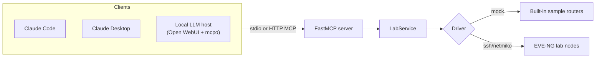

# Connecting a client

The *model* never speaks MCP directly — an MCP **host** runs the tool-calling loop and connects
the tools to whatever model you point it at. This server is deliberately thin: MCP tools are
just typed Python functions with useful docstrings, while the actual networking code lives in a
normal service layer.



All clients use the same stdio launch shape. Replace `<ABSOLUTE_PATH_TO_REPO>` with the
absolute path to your local clone, and point `PACKET_CODERS_INVENTORY` at the inventory you
want (start with `configs/inventory.mock.yaml`, switch to your git-ignored
`inventory.local.yaml` for the real lab — see [real-lab.md](real-lab.md)). A ready-to-edit
template lives at `examples/mcp.json`.

## Claude Code

Register the server from the repo root with the CLI:

```bash
claude mcp add packet-coders-lab \
  --env PACKET_CODERS_INVENTORY=<ABSOLUTE_PATH_TO_REPO>/configs/inventory.mock.yaml \
  -- uv run --project <ABSOLUTE_PATH_TO_REPO> packet-coders-mcp
```

Or commit a project-scoped `.mcp.json` at the repo root:

```json
{
  "mcpServers": {
    "packet-coders-lab": {
      "command": "uv",
      "args": ["run", "--project", "<ABSOLUTE_PATH_TO_REPO>", "packet-coders-mcp"],
      "env": {
        "PACKET_CODERS_INVENTORY": "<ABSOLUTE_PATH_TO_REPO>/configs/inventory.mock.yaml"
      }
    }
  }
}
```

Verify with `claude mcp list` (or `/mcp` inside Claude Code), then call `list_lab_devices`.

## Claude Desktop

Add the same server block to Claude Desktop's config file, then restart the app.

- macOS: `~/Library/Application Support/Claude/claude_desktop_config.json`
- Windows: `%APPDATA%\Claude\claude_desktop_config.json`

```json
{
  "mcpServers": {
    "packet-coders-lab": {
      "command": "uv",
      "args": ["run", "--project", "<ABSOLUTE_PATH_TO_REPO>", "packet-coders-mcp"],
      "env": {
        "PACKET_CODERS_INVENTORY": "<ABSOLUTE_PATH_TO_REPO>/configs/inventory.mock.yaml"
      }
    }
  }
}
```

`uv` must be on the PATH that the desktop app inherits. If the server does not appear, use
an absolute path to the `uv` binary (`which uv`) as the `command`.

> To skip the out-of-band confirmation code on Claude Desktop/Code (rely on the client's own
> per-call approval instead), add `"PACKET_CODERS_REQUIRE_CONFIRM_CODE": "false"` to the `env`
> block. See [safety.md](safety.md).

## Local LLMs (Ollama / vLLM)

You can drive this server entirely with a local model — no Anthropic API involved. The key
idea is the split between the **MCP host** (runs the tool-calling loop) and the **inference
backend** (serves chat completions). The model itself does not speak MCP; the host does.

This guide uses **[Open WebUI](https://github.com/open-webui/open-webui) + [mcpo](https://github.com/open-webui/mcpo)**.
`mcpo` wraps a stdio MCP server as an OpenAPI tool server that Open WebUI can call, and Open
WebUI connects to either backend below. (The one-command Docker stack in the README wires all
of this up for you; the steps here are for a manual / custom setup.)

```text
Open WebUI (MCP host)
  ├── mcpo  ──► packet-coders-mcp (this server)
  └── chat completions ──►  Ollama   @ Mac Mini   (Qwen3 ~30B-class)
                           vLLM     @ GPU box     (smaller models)
```

**1. Expose the MCP server through mcpo:**

```bash
PACKET_CODERS_INVENTORY=<ABSOLUTE_PATH_TO_REPO>/configs/inventory.mock.yaml \
  uvx mcpo --port 8000 -- uv run --project <ABSOLUTE_PATH_TO_REPO> packet-coders-mcp
```

In Open WebUI, add `http://localhost:8000` as a **tool server** (**Settings → Integrations →
Manage Tool Servers** — called *Tools* in older builds). The six lab tools then show up to the
model. **If you run Open WebUI in Docker, that URL has a catch — see [Open WebUI setup](#open-webui-setup)
below.**

**2a. Backend — Ollama (e.g. on a Mac Mini, reached over Tailscale):**

- Point Open WebUI's Ollama connection at the tailnet host: `http://<your-tailnet-host>:11434`.
- Use a **tool-calling-capable** model (Qwen3 is a strong pick; it selects tools reliably).
- **Raise the context window.** Ollama defaults to a small context (~4K), and the tool
  schemas plus verbose `show` output overflow it — which looks like "the model ignored the
  tools." Set it larger, e.g. `OLLAMA_CONTEXT_LENGTH=32768 ollama serve`, or bake `num_ctx`
  into a Modelfile.

**2b. Backend — vLLM (e.g. on a GPU box, OpenAI-compatible):**

- Tool calling is **off by default** in vLLM. Launch with auto tool choice **and** a parser
  that matches your model:

  ```bash
  vllm serve <your-qwen3-model> --enable-auto-tool-choice --tool-call-parser hermes
  ```

  The correct `--tool-call-parser` is model-dependent (Qwen-family commonly uses the
  `hermes` parser) — **verify against the current vLLM docs for your exact model.** With the
  wrong parser, the model emits tool calls as plain text and nothing fires.
- Add it to Open WebUI as an OpenAI connection: `http://<your-tailnet-host>:8000/v1`.

### Open WebUI setup

If you're standing one up from scratch — or you hit *"error connecting to the server"* or
*"the model ignores the tools"* — this is the part that trips everyone up.

**Run a disposable local Open WebUI (optional).** Any existing instance works:

```bash
docker run -d -p 3000:8080 \
  --add-host=host.docker.internal:host-gateway \
  -e WEBUI_AUTH=False \
  -e OLLAMA_BASE_URL=http://host.docker.internal:11434 \
  -v owui-demo:/app/backend/data \
  --name owui-demo ghcr.io/open-webui/open-webui:main
```

Open `http://localhost:3000` (`WEBUI_AUTH=False` skips the login for a single-user demo).

**The Docker URL split (the #1 gotcha).** When Open WebUI runs in a container it reaches its
two dependencies over *different* network paths, so they take *different* URLs:

| You're adding | In Open WebUI | Fetched by | URL (Open WebUI in Docker, same host) |
| --- | --- | --- | --- |
| Model backend (Ollama) | Settings → Connections | the **container** (backend) | `http://host.docker.internal:11434` |
| Tool server (mcpo) | Settings → **Integrations** | your **browser** | `http://localhost:8000` |

Open WebUI calls OpenAPI tool servers **from the browser**, but reaches model backends **from
the server process**. `host.docker.internal` resolves inside the container but means nothing to
your browser; `localhost` is the reverse. *(If you run Open WebUI natively —
`pip install open-webui` — both are simply `localhost`.)*

**Add the tool server.** Settings → **Integrations** → **Manage Tool Servers** → **+** → enter
the **bare base URL** (`http://localhost:8000`) — no `/openapi.json` (Open WebUI appends it) and
no API key unless you started `mcpo` with `--api-key`. It should validate and list the six tools.

**Make the model actually call the tools.** Open the model's **Advanced Params** (chat ⚙️ or the
model editor) and set **Function Calling → Native**. With the default mode, Ollama models
routinely ignore connected tools — the server looks fine, the model just never calls it. Pair
this with the raised context window above.

**Model-strength guidance:** lead with the larger Qwen3 model as the "driver" — it picks the
right tool and emits clean JSON. Keep smaller models (and Gemma variants, which are less
consistent at function calling) on the **read-only** tools, or on `configure_device` with
`dry_run=True` only. A weak model in an auto-confirming agent loop is exactly where you do
*not* want unattended writes (see [safety.md](safety.md)).

## Smoke-test the chain (no UI)

Before wiring up a UI, confirm the model can actually drive the tools with
`scripts/local_llm_smoke.py`. It exposes only the read-only tools (no `configure_device`), so
it can never write to a device. The simplest run needs nothing but a local model and the mock
lab — no GPU, no network gear, no API key:

```bash
ollama pull llama3.2     # ~2 GB; a small tool-calling model
uv venv && uv pip install -e .
LLM_MODEL=llama3.2 uv run python scripts/local_llm_smoke.py "List the lab devices."
```

Expected: the model calls `list_lab_devices` and answers `r1, r2, spine1`. Point it at your
real backends and lab by overriding the defaults:

```bash
LLM_BASE_URL=http://<your-tailnet-host>:11434/v1 \
LLM_MODEL=qwen3.6:35b-32k \
PACKET_CODERS_INVENTORY=./configs/inventory.local.yaml \
  uv run python scripts/local_llm_smoke.py "Are SW1's OSPF neighbors all FULL?"
```

Works the same against vLLM — point `LLM_BASE_URL` at `http://<host>:8000/v1`. If the smoke
test passes but the UI doesn't, the problem is one of the Open WebUI settings above, not the
model or the server.

## Adding external connectors (multi-server mcpo)

The lab server is just one MCP server — the same host can combine it with off-the-shelf
connectors. `mcpo` mounts **several MCP servers behind one process** via a config file, each
under its own URL prefix. A template is in `examples/mcpo.config.example.json`; it adds the
official [filesystem connector](https://github.com/modelcontextprotocol/servers/tree/main/src/filesystem)
alongside the lab server:

```bash
# fill in the placeholders first, then:
uvx mcpo --port 8000 --api-key "$KEY" --config ~/.config/packet-coders-mcpo.config.json
```

Each server is served under `/<name>`, so in Open WebUI you add **one tool server per prefix**:

| Connector | Open WebUI tool-server URL |
| --- | --- |
| Lab tools | `http://<host>:8000/packet-coders` |
| Filesystem | `http://<host>:8000/filesystem` |

> **Migrating from a single-server mcpo:** switching to `--config` moves the lab tools from
> the root URL to `/packet-coders`. Update your existing Open WebUI connection's URL or it
> will stop returning tools.

A natural demo: the model checks the lab, then **writes the report to a file** via the
filesystem connector ("save SW1's OSPF status to `ospf-report.md`").

**Connector safety:**
- **Scope the filesystem connector to a dedicated sandbox directory** — pass that one path as
  its argument, never `$HOME` or the repo. The server refuses access outside it
  (`list_allowed_directories` shows the boundary); it can read **and write** within it.
- **Pin the connector version** (`@…@2026.1.14`) and treat `npx -y` as installing a
  dependency — vet it like any other.
- Use the **Function Name Filter List** in Open WebUI to drop tools you don't want exposed
  (e.g. `!move_file`, `!edit_file`) the same way you would `!configure_device`.
